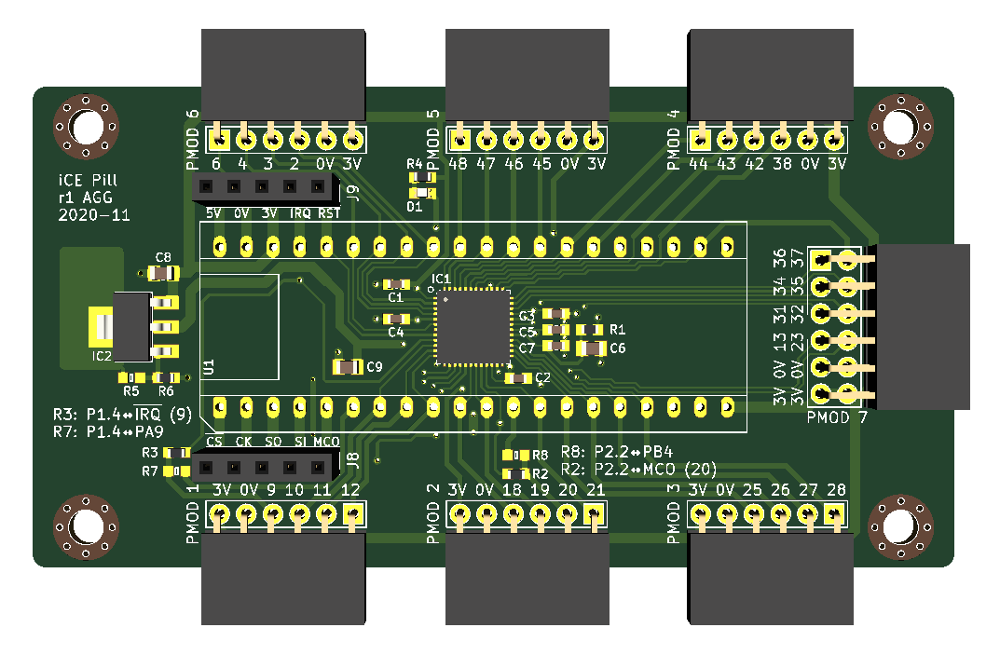

# iCE Pill

Breakout board for iCE40UP5k with the STM32F411 "Black Pill" board.

This board breaks all the iCE40UP5k GPIO to PMOD headers, most of which are
also connected to Black Pill pins, allowing either the STM32 or the iCE40 to
drive each PMOD pin. The iCE40's SPI and configuration pins are connected to
the Black Pill, allowing the STM32 to program and control the iCE40.

The SPI and configuration pins are also exposed on the J8 and J9 pin headers,
allowing connection just to these signals and then all PMOD pins can be
exclusively used by the iCE40.

Two additional STM32 pins can be connected to the iCE40: PA8, which can be used
in its MCO or TIM1 CH1 alternate modes to generate a clock for the iCE40, and
PB10, which can be used to signal an interrupt from the iCE40. Zero-ohm
resistors are be fitted in R2 and R3 to connect these signals to PMOD pins
as well, and zero-ohm resistors can optionally be fitted in R7 and R8 to
connect PA9 and PB4 from the STM32 to the same PMOD pins. This configuration
means the iCE40 is always connected to PA8 (clock) and PB10 (interrupt), and
either those iCE40 pins can connect to the PMOD _or_ the STM32 pins PA9 and PB4
can connect to the PMOD instead.

R5 and R6 are present in case a 1.2V fixed LDO is not available and you need
to use an adjustable LDO. Otherwise, leave R5 not fitted and use a zero-ohm
resistor for R6 (the default).

The LED D1 is connected to the RGB0 _and_ RGB1 pins on the iCE40 to simplify
routing; it is recommended that only one pin is used at the same time when
driving the LED.

Pin 35 connects to PMOD 7 pin 8; this pin can be a PLL input to the iCE40. If
the PLL is in use at all (whether fed from pin 35 or any other signal), then
pin 35 cannot be used as a regular input.

| PMOD      | iCE40 | STM32 | Notes
|-----------|-------|-------|------
| P1.1      | 12    | PA12  |
| P1.2      | 11    | PA11  |
| P1.3      | 10    | PA10  |
| P1.4      | 9     | PA9   | Used for IRQ with PB10, PA9 disconnected by default
|           |       |       |
| P2.1      | 21    | PB5   |
| P2.2      | 20    | PB4   | Used for CLK with PA8, PB4 disconnected by default
| P2.3      | 19    | PB3   |
| P2.4      | 18    | PA15  |
|           |       |       |
| P3.1      | 28    | PB9   |
| P3.2      | 27    | PB8   |
| P3.3      | 26    | PB7   |
| P3.4      | 25    | PB6   |
|           |       |       |
| P4.1      | 44    | PA1   |
| P4.2      | 43    | PA0   |
| P4.3      | 42    |       |
| P4.4      | 38    | PC13  |
|           |       |       |
| P5.1      | 48    | PA5   |
| P5.2      | 47    | PA4   |
| P5.3      | 46    | PA3   |
| P5.4      | 45    | PA2   |
|           |       |       |
| P6.1      | 6     | PB1   |
| P6.2      | 4     | PB0   |
| P6.3      | 3     | PA7   |
| P6.4      | 2     | PA6   |
|           |       |       |
| P7.1      | 36    |       |
| P7.2      | 34    |       |
| P7.3      | 31    |       |
| P7.4      | 13    |       |
| P7.7      | 37    |       |
| P7.8      | 35    |       | If PLL active, can only be used as PLL input
| P7.9      | 32    |       |
| P7.10     | 23    |       |
|           |       |       |
|           | 14    | PB14  | SPI SO
|           | 15    | PB13  | SPI SCK
|           | 16    | PB12  | SPI CS
|           | 17    | PB15  | SPI SI
|           | 8     | PB2   | iCE40 CRESET
|           |       |       |
|           | 39    |       | LED on iCE40 RGB0 pin
|           | 40    |       | Connected to pin 39

Symbols and footprints copied from [agg-kicad]. This schematic and PCB design
are licensed under the Creative Commons [CC0 public domain dedication]. It is
provided with no warranty.

[agg-kicad]: https://github.com/adamgreig/agg-kicad
[CC0 public domain dedication]: https://creativecommons.org/publicdomain/zero/1.0/

## Revision History

### 1.0: 2020-11-08

* First revision.
* Errata:
    * None yet.
