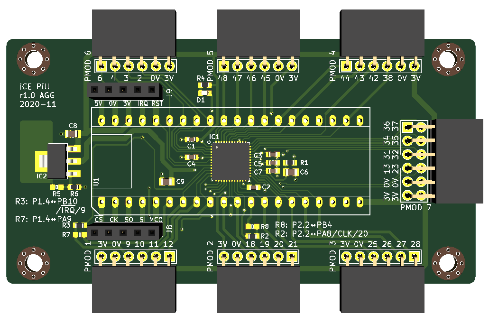

# iCE Pill

Breakout board for iCE40UP5k with the STM32F411 "Black Pill" board.

This board connects all iCE40UP5k pins to all the STM32 pins, and exposes
an additional double PMOD. Alternatively, the iCE40UP5K can be connected
using J8 and J9 to just provide power and configuration.

R2 and R3 are used to connect the MCO (PA8) and IRQ (PB10) lines to two
signals in PMOD 1 and thereby to the iCE40UP5k. By default these are connected
but if you don't require clock or interrupts or if you need to use these STM32
pins, you can remove R2 and R3 to break the connection.

R5 and R6 are present in case a 1.2V fixed LDO is not available and you need
to use an adjustable LDO. Otherwise, leave R5 not fitted and use a 0R for R6.

The LED D1 is connected to the RGB0 _and_ RGB1 pins on the iCE40 to simplify
routing; it is recommended that only one pin is used at the same time when
driving the LED.

Symbols and footprints copied from [agg-kicad]. This schematic and PCB design
are licensed under the Creative Commons [CC0 public domain dedication]. It is
provided with no warranty.

[agg-kicad]: https://github.com/adamgreig/agg-kicad
[CC0 public domain dedication]: https://creativecommons.org/publicdomain/zero/1.0/

## Revision History

### 1.0: 2020-11-08

* First revision.
